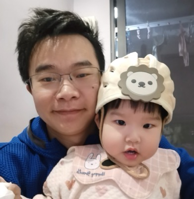

::: {.grid .hero-section}

::: {.g-col-12 .g-col-md-4 .g-col-lg-3 .text-center .hero-sidebar}
# 江斌

<!--  -->

  <a href="https://github.com/jiangbingo" class="btn btn-outline-dark btn-sm" role="button">
    <i class="bi bi-github"></i> Github
  </a>
  <a href="mailto:jiangbingo@hotmail.com" class="btn btn-outline-secondary btn-sm" role="button">
    <i class="bi bi-envelope"></i> Email
  </a>

:::

::: {.g-col-12 .g-col-md-8 .g-col-lg-9}

## 个人简介

**AI 应用工程师 / Python 后端开发工程师**

来自杭州 / 武汉，15 年软件开发与测试经验。从嵌入式硬件、自动化测试，到云端后端与大模型应用，能够将复杂业务需求转化为稳定、可扩展的工程实现。

:::

:::

## 核心能力

::: {.grid .my-4}

::: {.g-col-12 .g-col-md-6 .g-col-lg-4}

🤖

AI 应用工程

RAG 检索增强、Prompt Engineering、Agent RAG、Text-to-SQL

:::

::: {.g-col-12 .g-col-md-6 .g-col-lg-4}

⚙️

Python 后端

FastAPI、Django、Pydantic、异步架构、消息队列、RESTful API

:::

::: {.g-col-12 .g-col-md-6 .g-col-lg-4}

☁️

云原生 & ML 部署

Azure Functions、Serverless、ML Endpoint、GitHub Actions CI/CD

:::

::: {.g-col-12 .g-col-md-6 .g-col-lg-4}

🧠

深度学习

PyTorch 2.2.0+、TensorFlow 2.19.1、YOLOv8、ONNX Runtime

:::

::: {.g-col-12 .g-col-md-6 .g-col-lg-4}

🔄

自动化 & DevOps

自动化测试、效率工具、CI/CD 流程、持续集成

:::

::: {.g-col-12 .g-col-md-6 .g-col-lg-4}

💻

全栈工程背景

嵌入式开发（C/汇编）、Python 全栈、跨领域技术融合

:::

:::

## 技能栈

::: {.grid}

::: {.g-col-12 .g-col-md-6 .g-col-xl-4}

<h3 class="card-title">AI / 大模型 & RAG</h3>
<ul class="skills-list">
<li><strong>RAG 检索增强</strong>：文档解析、向量检索（Milvus）、Agent RAG</li>
<li><strong>Prompt Engineering</strong>：多轮对话、工具调用、Text-to-SQL</li>
<li><strong>缺陷检测大模型应用</strong>：YOLOv8 + 通用 LLM 协同</li>
<li><strong>LLM Function Calling</strong>：与工作流编排、Vanna.ai SQL生成</li>
<li><strong>深度学习框架</strong>：PyTorch 2.2.0+、TensorFlow 2.19.1、Keras 3.11.2</li>
</ul>

:::

::: {.g-col-12 .g-col-md-6 .g-col-xl-4}

<h3 class="card-title">后端开发 & 数据</h3>
<ul class="skills-list">
<li><strong>Languages</strong>: Python (FastAPI, Django, Flask), <strong>C++</strong></li>
<li><strong>Async</strong>: Celery, RabbitMQ, WebSocket, 异步任务调度</li>
<li><strong>DB</strong>: MariaDB, MySQL, Milvus, <strong>PostgreSQL</strong>, SQLAlchemy 2.0+</li>
<li><strong>Data</strong>: Scrapy, Pandas, NumPy, SciPy, UMAP降维, HDBSCAN聚类</li>
<li><strong>API Design</strong>: RESTful API, Pydantic 2.9+, 异步HTTP</li>
</ul>

:::

::: {.g-col-12 .g-col-md-6 .g-col-xl-4}

<h3 class="card-title">云原生 & 工程化</h3>
<ul class="skills-list">
<li><strong>Azure</strong>: Function, ML Service, Serverless, Web App, Blob Storage</li>
<li><strong>DevOps</strong>: Jenkins, GitLab CI, GitHub Actions, Docker, JIRA</li>
<li><strong>ML DevOps</strong>: wheel包自动构建、GitHub Actions CI/CD、模型分发</li>
<li><strong>Test</strong>: RobotFramework, <strong>pytest</strong>, <strong>unittest</strong></li>
<li><strong>Embedded</strong>: C / Assembly (MCU, ARM, DSP)</li>
</ul>

:::

:::

## 代表项目

::: {.grid}

::: {.g-col-12 .g-col-lg-6}

<h3 class="card-title">缺陷检测大模型应用平台</h3>

2025.04 – 至今 · 工业缺陷检测 · FastAPI / Azure / ML

<ul>
<li><strong>后端架构</strong>：搭建缺陷检测系统后端，融合专用视觉模型（YOLOv8）与通用大模型，支持在线缺陷识别与判定。</li>
<li><strong>接口设计</strong>：采用 Pydantic 2.9+ 模型结合 FastAPI 框架，路由 RESTful 化，确保系统高效稳定。</li>
<li><strong>工程化部署</strong>：实现 Function Calling 与 ML 模型工程化部署（本地/云上），优化资源配置，支持 Azure ML Endpoint。</li>
<li><strong>高性能通信</strong>：设计 RabbitMQ 异步消息队列与 WebSocket 通信，提升系统吞吐与用户体验。</li>
<li><strong>技术栈</strong>：PyTorch 2.2.0+、ONNX Runtime 1.16.0+、Celery、RabbitMQ、Azure Web App、Blob Storage</li>
</ul>

:::

::: {.g-col-12 .g-col-lg-6}

<h3 class="card-title">RAG 智能问答系统</h3>

2024.11 – 2025.04 · 企业知识库 · RAG / Milvus

<ul>
<li><strong>全栈负责</strong>：负责后端架构、编码、工作流及部署全环节，项目已预上线。</li>
<li><strong>核心技术</strong>：主导 AI 知识库搭建，开发 Prompt 提示词工程，推进 RAG 检索增强生成开发。</li>
<li><strong>数据优化</strong>：使用 Milvus 设计向量数据库结构，显著提升数据处理效率和召回准确性。</li>
<li><strong>Text-to-SQL</strong>：实现自然语言到SQL转换，集成Vanna.ai进行智能查询。</li>
<li><strong>技术栈</strong>：FastAPI、Milvus、PostgreSQL、SQLAlchemy 2.0+、Agent RAG</li>
</ul>

:::

::: {.g-col-12 .g-col-lg-6}

<h3 class="card-title">质量分析平台（piyi-api）</h3>

企业项目 · FastAPI + 算法一体化

<ul>
<li><strong>算法集成</strong>：基于 TensorFlow 2.19.1 + Keras 3.11.2 开发质量分析模型，实现 UMAP 降维 + HDBSCAN 聚类。</li>
<li><strong>特征工程</strong>：使用 NumPy、SciPy、Pandas 进行特征提取和数据处理，支持高维数据降维可视化。</li>
<li><strong>混合部署</strong>：支持本地模型和 Azure ML Endpoint 自动切换，实现弹性扩展。</li>
<li><strong>技术栈</strong>：TensorFlow 2.19.1、Keras 3.11.2、UMAP-learn 0.5.9、HDBSCAN 0.8.40、scikit-learn 1.7.2</li>
</ul>

:::

::: {.g-col-12 .g-col-lg-6}

<h3 class="card-title">AI推理引擎（AI-Project）</h3>

企业项目 · YOLOv8 ONNX推理

<ul>
<li><strong>模块化设计</strong>：开发可独立安装的Python包（ai_libs + fabric_defect），支持pip一键部署。</li>
<li><strong>高性能推理</strong>：基于 PyTorch 2.2.0+ 和 ONNX Runtime 1.16.0+ 实现 YOLOv8 目标检测，支持GPU加速。</li>
<li><strong>CI/CD自动化</strong>：配置 GitHub Actions 自动构建wheel包和GitHub Release，实现生产级部署。</li>
<li><strong>技术栈</strong>：PyTorch 2.2.0+、ONNX 1.15.0+、OpenCV 4.8.1+、pyproject.toml、GitHub Actions</li>
</ul>

:::

::: {.g-col-12 .g-col-lg-6}

<h3 class="card-title">CASPI业务系统（caspi-api）</h3>

企业项目 · 业务API + CI/CD

<ul>
<li><strong>API开发</strong>：基于 FastAPI 开发核心业务API，实现文件上传、批量删除等功能。</li>
<li><strong>CI/CD优化</strong>：重构 GitHub Actions 工作流，提升自动化部署效率。</li>
<li><strong>持续迭代</strong>：22个PR，活跃度高，代码质量优秀（83%合并率）。</li>
<li><strong>技术栈</strong>：FastAPI、Pydantic、GitHub Actions、Azure</li>
</ul>

:::

::: {.g-col-12 .g-col-lg-6}

<h3 class="card-title">Genesis大型项目</h3>

企业项目 · Agent RAG实践

<ul>
<li><strong>Agent RAG实践</strong>：AI代理与检索增强生成结合，处理复杂业务逻辑。</li>
<li><strong>大规模系统</strong>：项目体积174MB，多模块、多业务线综合系统开发。</li>
<li><strong>持续迭代</strong>：25次高质量代码提交，系统架构设计经验丰富。</li>
<li><strong>技术栈</strong>：Python、Agent RAG、复杂业务系统</li>
</ul>

:::

::: {.g-col-12 .g-col-lg-6}

<h3 class="card-title">3GPP 协议解析器</h3>

NOKIA · 文档解析 · Python

<ul>
<li><strong>技术挑战</strong>：针对 3GPP 协议超大 Word 文档的复杂表格（多维表格）和非结构化数据进行识别、纠错、解析。</li>
<li><strong>核心功能</strong>：开发 Python 文件解析器，自动化识别文本、表格、数据、格式错误并部分纠错，输出 log 文件。</li>
<li><strong>成果</strong>：正确解析并输出结构化数据，大幅提升协议文档处理效率。</li>
<li><strong>技术栈</strong>：Python、文档解析、数据清洗、结构化输出</li>
</ul>

:::

::: {.g-col-12 .g-col-lg-6}

<h3 class="card-title">自动化测试与效率工具</h3>

NOKIA · DevOps · Python / Shell

<ul>
<li><strong>云环境自动化工具</strong>：开发自动化预定云平台测试环境的 Python 工具，大幅提升团队工作效率。</li>
<li><strong>效率工具开发</strong>：开发多种自动化工具，包括 Sleeping Cell 检测工具、网络爬虫、Selenium 自动化测试工具等，提升测试与开发效率。</li>
<li><strong>技术栈</strong>：Python、Shell、SQL、Selenium、DevOps</li>
</ul>

:::

::: {.g-col-12 .g-col-lg-6}

<h3 class="card-title">电商云平台</h3>

杭州格菱 · Django · 后端开发

<ul>
<li><strong>后台模块开发</strong>：构建数据中心后台模块，基于 Python Django 编写代码，实现后台管理页面。</li>
<li><strong>数据采集</strong>：编写网络爬虫获取和整理 20G 级别的网络资源，构建数据云平台。</li>
<li><strong>成果</strong>：完成电商管理平台 Demo，实现数据采集、处理和展示全流程。</li>
<li><strong>技术栈</strong>：Python、Django、爬虫、数据处理</li>
</ul>

:::

::: {.g-col-12 .g-col-lg-6}

<h3 class="card-title">新标准扶梯项目</h3>

西子优迈 · 嵌入式开发 · C / 汇编

<ul>
<li><strong>嵌入式开发</strong>：基于 PLC、MCU、ARM、DSP 的逻辑软件编程（C、ASM 汇编）。</li>
<li><strong>测试工装</strong>：开发板和嵌入式系统的测试工装制作与维护，以及安全电子系统认证。</li>
<li><strong>技术指导</strong>：提供先锋产品技术指导，收集并解决工地现场问题。</li>
<li><strong>主要业绩</strong>：完成安全电子系统 SIL 2 认证；完成国内新国标自动扶梯首批产品的发布。</li>
<li><strong>技术栈</strong>：C、汇编、PLC、MCU、ARM、DSP</li>
</ul>

:::

:::

## 工作经历

杭州克雷登工业 · AI 应用工程师

2024.11 – 至今

<ul>
<li><strong>后端架构</strong>：负责后端设计与开发，采用 Pydantic + FastAPI，确保系统高效稳定。</li>
<li><strong>AI系统开发</strong>：设计开发智能问答系统，专注于 Prompt 工程及 RAG 技术选型实践，提升问答准确率与语义理解效果。</li>
<li><strong>ML工程化</strong>：开发缺陷检测机器学习算法，结合大模型应用进行工程化实践。</li>
<li><strong>云平台部署</strong>：负责 Azure 云平台系统（后端、Function Calling、ML）的工程化部署与性能优化。</li>
<li><strong>主要业绩</strong>：主导 FastAPI 项目重构，引入 Pydantic 实现数据模型校验，提升接口稳定性与可维护性；完成 RESTful 风格路由设计，提高前后端协作效率；负责数据库、向量数据库、缓存数据库等选型与架构设计，优化数据存储结构，支持高并发读写场景</li>
</ul>

杭州人本集团 · Python 后端开发

2024.08 – 2024.10 · 数字化 MES 平台

<ul>
<li><strong>技术规划</strong>：负责智能化数字化 MES 平台后台模块的技术规划。</li>
<li><strong>后端开发</strong>：负责业务逻辑编码实现（Django），设计异步 Celery 任务与 MariaDB 数据库结构。</li>
<li><strong>API设计</strong>：参与 API 接口设计与评审，编写技术文档与接口规范。</li>
<li><strong>主要业绩</strong>：编写 API 接口文档与接口规范；完成后端业务逻辑编码；进行 MES 系统设计</li>
</ul>

诺基亚通信技术有限公司 · 测试开发工程师

2016.10 – 2023.05

<ul>
<li><strong>自动化测试</strong>：基于 RobotFramework (灰盒) 和 TTCN-3 语言的测试项目。</li>
<li><strong>软件开发</strong>：参与 C++ 软件开发与测试。</li>
<li><strong>工具开发</strong>：基于 Python、Shell、Lua 开发自动化测试与平台工具，开发云环境自动化预定工具提升工作效率。</li>
<li><strong>DevOps 实践</strong>：使用 Jenkins、GitLab CI、Docker 等工具优化交付流程。</li>
</ul>

杭州格菱科技有限公司 · Python 开发

2014.12 – 2016.10 · 电商云平台

<ul>
<li>基于 Python Django 搭建数据云平台。</li>
<li>负责爬虫数据采集与处理。</li>
</ul>

西子优迈 · 软件开发工程师

2010.07 – 2014.09 · 新标准扶梯项目

<ul>
<li>负责基于 PLC、MCU、ARM、DSP 的逻辑软件编程（C、ASM 汇编）。</li>
<li>负责开发板和嵌入式系统的测试工装制作与维护，以及安全电子系统认证。</li>
<li>提供先锋产品技术指导，收集并解决工地现场问题。</li>
<li><strong>主要业绩</strong>：完成安全电子系统 SIL 2 认证；完成国内新国标自动扶梯首批产品的发布。</li>
</ul>

## 教育与证书

- **中南民族大学** · 本科 · 电子信息工程类 – 生物医学工程 · 2005 – 2010
- 大学英语六级

## 志愿与社区

西湖创客汇 · 创客导师

2015.06 – 2017.05

服务 1000+ 青年创客社区，分享技术经验，指导项目开发；组织并主持多场技术工作坊和黑客马拉松活动。

1566 创客公益基金 · 爱心大使

核心成员

作为核心成员，为有潜力的创客项目提供公益基金与技术支持；参与项目评审，帮助筛选和培养有社会价值的创新项目。

## 联系我

::: {.grid}

::: {.g-col-12 .g-col-md-8}
欢迎就 Python / AI 应用工程化 / RAG 系统 / 工业智能化等方向进行交流或合作。

- **邮箱**：[jiangbingo@hotmail.com](mailto:jiangbingo@hotmail.com)
- **GitHub**：[github.com/jiangbingo](https://github.com/jiangbingo)
- **所在城市**：杭州 / 武汉
:::

::: {.g-col-12 .g-col-md-4}

:::

:::
:::